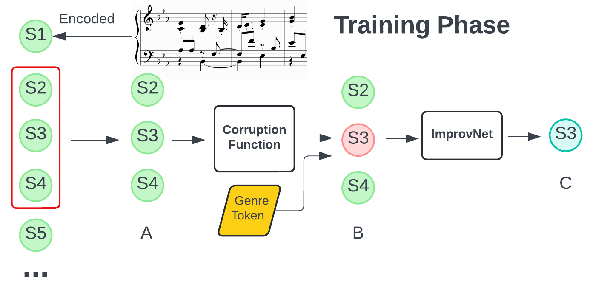
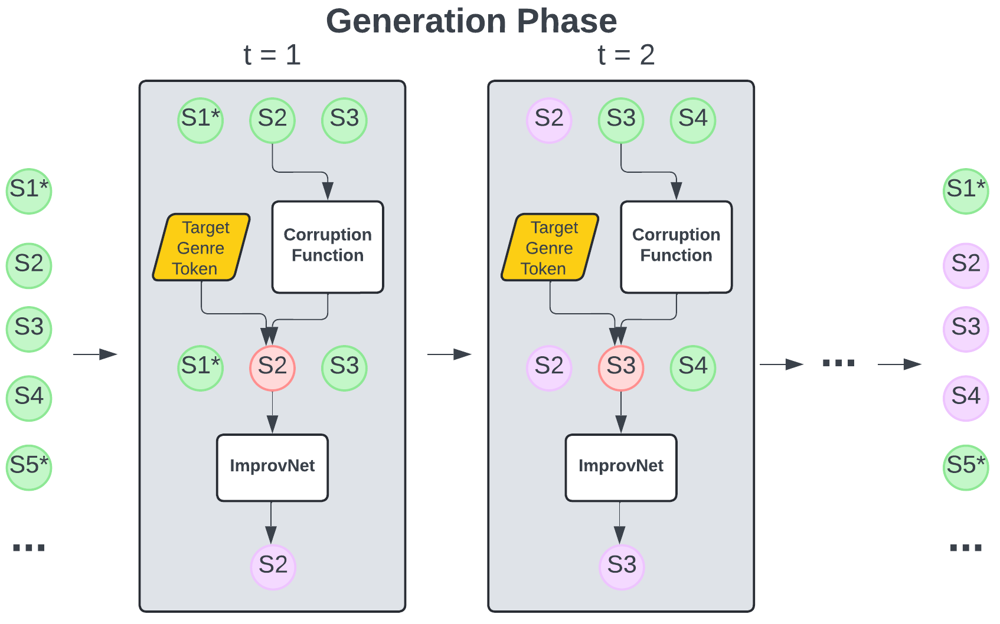

# ImprovNet: Generating Controllable Musical Improvisations with Iterative Corruption Refinement

🌐 [**Demo Website**](https://keshavbhandari.github.io/portfolio/improvnet.html)

📄 [**ArXiv Paper**](https://arxiv.org/abs/your-paper-id) 

🚀 [**Run in Colab**](https://colab.research.google.com/drive/1wywPizbCJOJoODzogEXY59wyBalw6Hay?usp=sharing)  
---

## Overview

ImprovNet is a transformer-based model designed to generate **expressive and controllable musical improvisations** using a self-supervised corruption-refinement strategy. It enables:

- **Expressive cross-genre (Classical -> Jazz) and intra-genre (Classical -> Classical or Jazz -> Jazz) improvisation**  
- **Expressive musical harmonization in different genre styles**  
- **Short prompt continuation**  
- **Short musical infilling**
- **User control over the degree of improvisation and structure preservation**  

ImprovNet outperforms existing models like **Anticipatory Music Transformer (AMT)** in continuation and infilling tasks. It also achieves **highly recognizable jazz-style improvisations**, with 79% of listeners correctly identifying genre transformations.  

ImprovNet relies on a corruption-refinement training strategy similar to [**Yin-Yang**](https://github.com/keshavbhandari/yinyang), to generate music in an improvisational style of the original composition. The entire piece is segmented into 5-second segments. During training (see figure below), a random segment is selected with context segments on its left and right. This segment is corrupted using one of the corruption functions described in the paper. The corrupted segment, combined with the original context, is fed into a transformer encoder along with conditional tokens for the genre and corruption type. The transformer decoder learns to reconstruct the original segment.


During generation (see figure below), 5-second segments are processed iteratively. A chosen segment is corrupted and refined based on a probability similar to that of training. For cross-genre improvisation, refinement conditions on the target genre token. This process iterates from beginning to end several times, gradually shaping the piece into the target genre.


For more details, refer to the paper:  
**ImprovNet: Generating Controllable Musical Improvisations with Iterative Corruption Refinement.**  

---

## Setup Instructions

### Clone the repository and install dependencies
```bash
!git clone https://github.com/keshavbhandari/improvnet.git
%cd improvnet
%pip install -r requirements.txt
```

### Download data and model artifacts
```bash
import gdown

# Download dataset and model artifacts
artifacts_url = 'https://drive.google.com/uc?id=11H3y2sFUFldf6nS5pSpk8B-bIDHtFH4K'
artifacts_out = '/content/improvnet/artifacts.zip'
gdown.download(artifacts_url, artifacts_out, quiet=False)

# Unzip files
!unzip -q /content/improvnet/artifacts.zip -d /content/improvnet/
```

### Instructions to generate midi files

First we need to generate the YAML config file and then we can use the YAML filepath to generate the midi piece for each task.

To generate with ImprovNet, specify the midi filepath and the wav filepath (see the Colab notebook to see how the midi file is converted to wav). Then place both filepaths in the input folder. **Note - the midi file must contain only piano track!**

**Preservation Ratio** - This argument is used to specify the percent of T-segments which will not be corrupted/refined. In other words, they are preserved from the original midi file. These T-segments are determined by SSMNet (see https://arxiv.org/pdf/2309.02243) which detects novel structural segments in the original piece. The idea is to preserve the start of new sections so the structure of the generation is consistent with the original. This also allows the listener to recognize parts of the original within the generated music. If you doesn't want to preserve any T-segments, then this can be turned off by setting the Preservation Ratio to 0.

**Context before/after** - This argument refers to the number of T-segments to consider as context before and after the corruption segment. For example, if the context before is 5 and after is 2, then we consider 25 (5*5) seconds before and 10 (5*2) seconds after the corrupted T-segment of 5 seconds. See the diagram above for an illustration of this.

**T-segment start** - This argument refers to the indice where the generation should start from. If T-segment start is 2, then the first 10 seconds is preserved. The idea is to have the listener recognize the original music initially before generating a jazz stylized version of it.

**Write intermediate files** - We recommend checking this option as this argument writes midi files for each pass. Otherwise you would need to wait till the final pass to download the midi file for the last pass.

**Corruption rate** - This is the percentage of T-segments that will be corrupted and then refined by the model. If corruption rate is 0.5, then 50% of the segments will be corrupted/refined. The T-segments are chosen randomly.

**Number of passes** - By adding more passes, you will be generating something that is quite different to the original and vice-versa.

**Corruption type** - Check the different types of corruptions along with their descriptions at the top of the notebook.


There are 9 different types of corruptions that the model is trained on:

1. **Pitch velocity mask** - Masks both the pitch and velocity (loudness) values
2. **Onset duration mask** - Masks both the onset (start of note) and duration values
3. **Whole mask** - Masks out all the notes of the T segment
4. **Permute pitches** - Permutes the midi pitch values
5. **Permute pitch velocity** - Permutes the midi pitch and velocity values
6. **Fragmentation** - Retains a portion/fragment of the notes and omits the rest
7. **Incorrect transposition** - Randomly changes the pitch value for a few notes between (-5, +5)
8. **Skyline** - Keeps the top midi pitch value at every temporal step and omits the rest below it
9. **Note modification** - Randomly omits and adds a few notes


### Generate an improvisation
To generate an improvisation of a piece, you need to prepare the config file first. For intra-genre improvisations, we recommend converting the midi file to wav and listing the filepaths for both. The wav file is needed for the SSMNet algorithm to preserve novel segments in the music. However, if you decide not to preserve any segments, then no wav file is needed and the Preservation Ratio parameter can be set to 0. In addition, you may want to modify the corruption functions and number of passes to get the improvisation that works for you. See the default values in the config file to get started and run the code below. The outputs for each pass will be stored in the output folder.

#### Note on which corruption to use:
When the beat of the music is too strong, we suggest not to use onset duration mask. If there are many repetitions in the music or if the generated music isn't changing much compared to the original, we suggest using the pitch velocity mask or whole mask for multiple passes. To change the harmony, we suggest using skyline for multiple passes. A combination of different corruptions is recommended for genre style transfer.


```bash
!python improvnet/generation.py --config configs/config_style_transfer.yaml
```

### Harmonize a monophonic melody
ImprovNet can harmonize a monophonic piano melody in an expressive style with genre-style harmonizations. Similar to improvisations, modify the config file. Do not changing the corruption functions and number of passes. However, you may experiment with different context windows. Run the following code below to generate the outputs for each pass.

```bash
!python improvnet/harmonize.py --config configs/config_harmony.yaml
```

### Generate a short prompt continuation
ImprovNet can continue a prompt for 5-20 seconds. To try it, provide the midi filepath that contains the prompt in the config file. Do not modify the corruption functions and number of passes. If the context_before is set as 5, ImprovNet can see 25 seconds (5*5) of the prior context (prompt). If context_infilling is set as 4, ImprovNet generates 20 seconds (4*5) of continuation. Run the code below to generate from a short prompt.

```bash
!python improvnet/generate.py --config configs/config_prompt_generation.yaml
```

### Generate a short infilling
ImprovNet can generate short infillings for missing segments in a piece. To try it, provide the midi filepath that contains the missing segment in the config file. Do not modify the corruption functions and number of passes. If the context_before and context_after are set as 4, ImprovNet can see 20 seconds (4*5) of the prior and post context. If context_infilling is set as 2, ImprovNet generates 10 seconds (2*5) of infilling. Run the code below to generate a short infilling.

```bash
!python improvnet/generate.py --config configs/config_infilling.yaml
```

### Recreate experiments by training models from scratch
To train individual models, use the following commands:

- Pretrain ImprovNet:
  Set run_pretraining: True in the config file and run the following command.
  ```bash
  !python improvnet/train.py --config configs/configs_style_transfer.yaml
  ```
- Finetune ImprovNet:
  Set run_pretraining: False in the config file and run the following command.
  ```bash
  !python improvnet/train.py --config configs/configs_style_transfer.yaml
  ```
- Train the genre classifier model:
  ```bash
  !python improvnet/train_classifier.py --config configs/configs_style_transfer.yaml
  ```

## Citation

If you use this repository in your work, please cite:

```plaintext
@article{bhandari2025improvnet,
  author    = {Bhandari, Keshav and Chang, S. and Lu, T. and Enus, F. R. and Bradshaw, L. and Herremans, D. and Colton, S.},
  title     = {ImprovNet: Generating Controllable Musical Improvisations with Iterative Corruption Refinement},
  journal   = {arXiv preprint},
  year      = {2025},
  archivePrefix = {arXiv},
  eprint    = {2501.XXXXX}, % Replace with actual arXiv identifier
  primaryClass = {cs.SD} % Adjust field if necessary (e.g., cs.AI, cs.LG)
}
